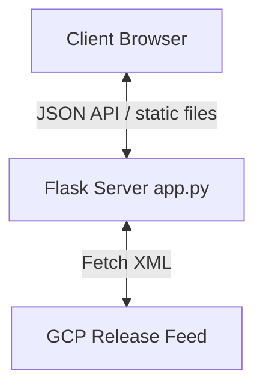
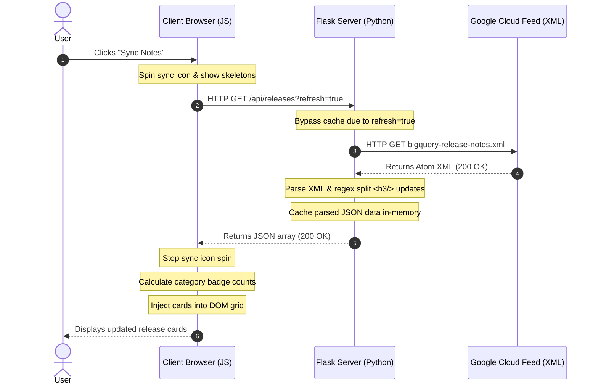

# BigQuery Release Notes Hub: Architecture & Flow Breakdown

This document provides a detailed breakdown of the application's architecture, division of responsibilities between server and client, and a step-by-step walkthrough of key data flows.

---

## 1. Core Features

1. **Granular Categorization**: Divides multi-update release days into distinct cards by detecting headings (`<h3>`) in the source HTML.
2. **Real-time Filters & Search**: Offers instantaneous client-side searching and category filtering with auto-updating badges.
3. **Draft Tweet Composer Modal**: An interactive, custom-styled editor featuring a live character counter progress ring and direct integration with X/Twitter.
4. **Persistent Dark/Light Mode**: Styled fully via CSS custom properties and saved to `localStorage` for visual consistency.
5. **Caching & Resilient Fallbacks**: Avoids overloading external servers by caching feeds locally and serving a warn banner if a sync fails.

---

## 2. Server vs. Client Breakdown

The project is split into a **Python Flask** server and a **Vanilla HTML/CSS/JS** client:

### 🖥️ Server-Side ([app.py](file:///C:/Users/Grat/Documents/agy-cli-projects/app.py))
The server acts as a data pipeline and proxy. It handles:
- **XML Fetching**: Communicates with the external GCP feed URL (`https://docs.cloud.google.com/feeds/bigquery-release-notes.xml`) using `urllib.request`.
- **Parsing**: Uses Python's standard `xml.etree.ElementTree` to parse the Atom feed format.
- **Granular Splitting**: Applies a regular expression split `re.split(r'(<h3[^>]*>.*?</h3>)', content_html)` to isolate each heading and its corresponding text into distinct release updates.
- **Text Cleansing**: Uses `re.sub` and `html.unescape` in `clean_html_to_text()` to generate clean plain-text summaries (without HTML tags) for Twitter.
- **API Routing**:
  - `GET /`: Serves [templates/index.html](file:///C:/Users/Grat/Documents/agy-cli-projects/templates/index.html).
  - `GET /api/releases`: Serves cached or freshly parsed release notes as JSON.
- **Memory Caching**: Keeps data cached for 5 minutes (`CACHE_DURATION = 300`) to guarantee high-performance responses.

### 🎨 Client-Side ([static/app.js](file:///C:/Users/Grat/Documents/agy-cli-projects/static/app.js) & [static/style.css](file:///C:/Users/Grat/Documents/agy-cli-projects/static/style.css))
The client governs presentation, interactive UI state, and sharing. It handles:
- **State Management**: Stores the fetched releases array, active search terms, and selected category.
- **Dynamic DOM Rendering**: Builds card items using safe, custom templates in `renderReleases()`.
- **Badge Count Calculations**: Aggregates releases by type and updates numerical counters dynamically on category chips.
- **Interactivity & Theme**: Triggers the Twitter composer, manages clipboard copy feedback, and manages the light/dark class swap on `<body>`.

---

## 3. Sample Flow: Syncing Release Notes

Here is a step-by-step description and diagram of what happens when a user clicks the **Sync Notes** button:

### Step 1: User Request
- The user clicks the **Sync Notes** button.
- The Javascript click listener triggers `fetchReleases(true)`.
- The UI immediately enters a loading state: the sync icon gains the `.spinning` class and skeleton placeholder cards are displayed.

### Step 2: Client-Server API Request
- The client sends an asynchronous `fetch()` request to `/api/releases?refresh=true`.
- The `refresh=true` query parameter instructs the Flask server to bypass the 5-minute memory cache.

### Step 3: Server Feed Download
- The Flask server executes `fetch_and_parse_feed()`.
- It performs an external HTTP GET request to `https://docs.cloud.google.com/feeds/bigquery-release-notes.xml` with a custom `User-Agent` header to prevent blocking.

### Step 4: XML Parsing & Splitting
- The server receives the raw XML and builds an ElementTree.
- For each entry (representing a day), it extracts `<title>` (the date), the base link, and the HTML `<content>`.
- The HTML content is split by `<h3>` headings using regex. If a day has 4 release updates, it generates 4 separate update structures, assigning unique IDs (e.g. `bq_June_15_2026_0`, `bq_June_15_2026_1`).
- For each sub-update, HTML tags are stripped to create a clean text snippet.

### Step 5: Caching & API Response
- The parsed structures are stored in the server's global `cache` dictionary along with a current timestamp `last_fetched`.
- Flask returns the JSON payload containing the releases array to the client.

### Step 6: Client Render & Presentation
- The Javascript handler receives the JSON array, stops the loading spinners, and saves the data to the global `releases` state.
- `updateCategoryBadges()` runs to recalculate the numbers.
- `applyFilters()` processes the search inputs and categories, then feeds the filtered items to `renderReleases()`.
- `renderReleases()` empties the grid and injects the new HTML elements with custom card styling.

---

## 4. Sample Flow: Tweeting an Update

1. The user clicks **Tweet** on a card.
2. The Javascript function `openTweetModal(release)` executes:
   - It computes the available character count for a snippet: `280 - (header + link + hashtags + newlines)`.
   - Truncates the plain-text release body to this limit, appending `...` if it was truncated.
   - Populates the textarea and loads the preview card.
   - Activates the modal using CSS classes.
3. The user edits the text. As they type:
   - `updateTweetLength()` runs.
   - It updates the character counter text and recalculates the SVG circle's `stroke-dashoffset`.
   - If the characters exceed 280, it colors the circle red and disables the "Post on X" button.
4. The user clicks **Post on X**:
   - The script opens `https://twitter.com/intent/tweet?text=<URI_encoded_draft>` in a new tab.
   - The modal closes.
